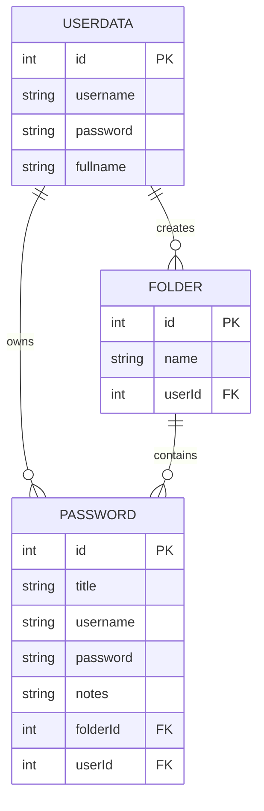

# Aplikasi Password Manager

Aplikasi Password Manager adalah sebuah aplikasi desktop yang dibangun menggunakan JavaFX untuk membantu pengguna mengelola password mereka dengan aman.

## Fitur Utama

1. Manajemen User
   - Login dan Register
   - Edit profil pengguna
   - Logout
2. Manajemen Folder
   - Membuat folder baru
   - Menampilkan daftar folder dalam bentuk tree
3. Manajemen Password
   - Menyimpan password dengan enkripsi
   - Mengelompokkan password dalam folder
   - Mencari password

## Arsitektur Aplikasi

Aplikasi ini dibangun dengan arsitektur MVVM (Model-View-ViewModel) dengan komponen:

- Models: Representasi data (UserModel, FolderModel)
- Views: Antarmuka pengguna (MainAppView, LoginDialog, FolderFormView)
- ViewModels: Logika bisnis (LoginViewModel, FolderViewModel)
- DAOs: Akses database (UserDao, FolderDao)

## Entity Relationship Diagram

## Keamanan

1. Password pengguna di-hash menggunakan SHA-256 sebelum disimpan di database
2. Password yang disimpan dienkripsi menggunakan algoritma AES
3. Menggunakan session management untuk menjaga keamanan login

## Teknologi yang Digunakan

1. JavaFX - Framework UI
2. SQLite - Database
3. Gradle - Build Tool
4. Google Guava - Library untuk hashing
5. Java Cryptography Architecture (JCA) - Untuk enkripsi
